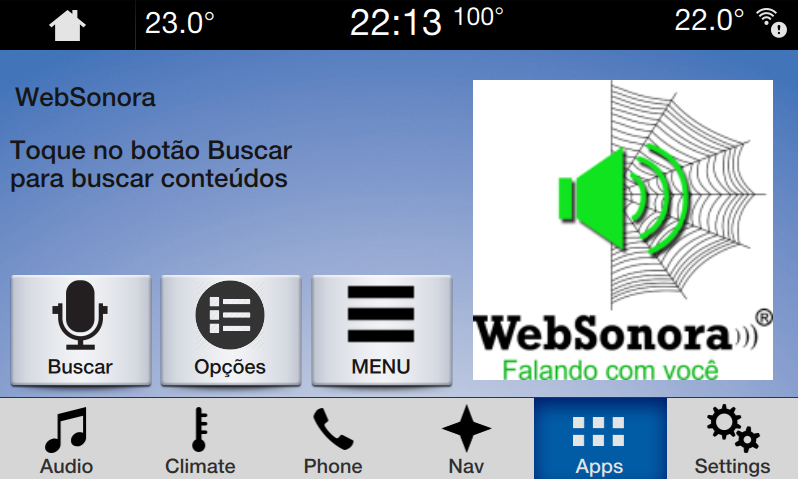
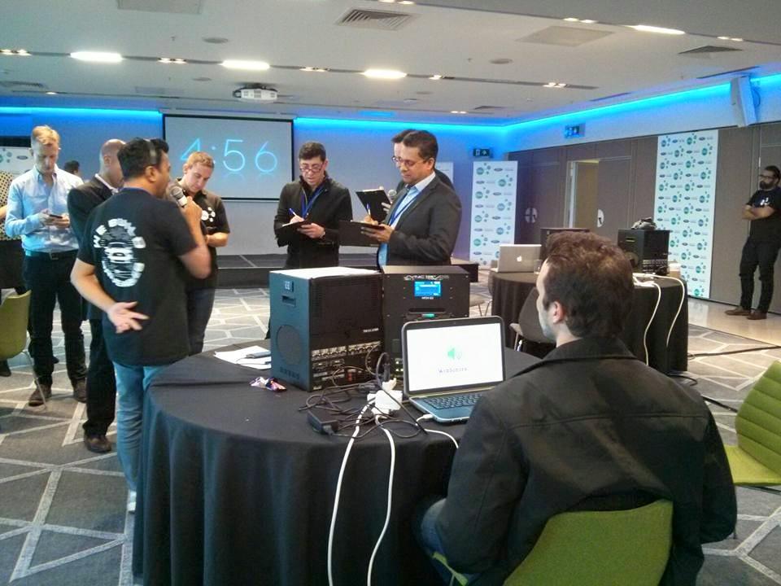
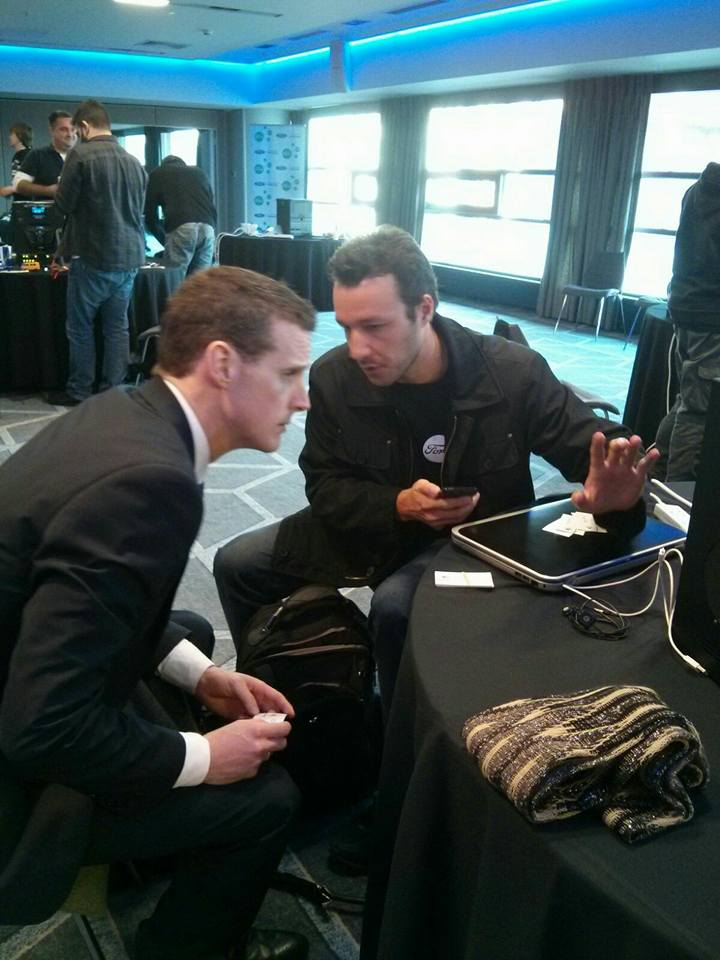
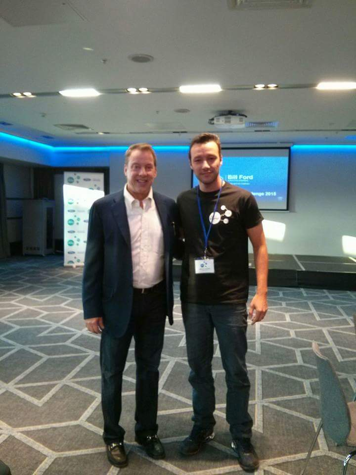

# WebSonora

> **Voice-enabled web radio application integrated with Ford SYNC/AppLink — listed in Ford's official AppLink catalog and demonstrated at the Ford MakeItDriveable Challenge in Dublin, Ireland.**



> WebSonora running natively inside the Ford SYNC 3 in-dash infotainment system. The interface is rendered directly on the vehicle's touchscreen, with voice command support and full AppLink integration.

---

## Overview

WebSonora is a voice-driven automotive application that allows drivers to search and stream web radio stations directly from the Ford SYNC infotainment system — hands-free, using only voice commands and the steering wheel controls.

The app was built to the Ford AppLink SDK specification, enabling full integration with SYNC 1 and SYNC 3 systems: voice recognition, hardware button mapping, and in-dash rendering — all without the driver touching a phone.

---

## Highlights

- **Listed in Ford's official AppLink application catalog** for SYNC-compatible apps ([archived snapshot — ford.com.br, August 2020](https://web.archive.org/web/20200812035452/https://www.ford.com.br/servico-ao-cliente/applink/catalogo-de-apps/))
- **Selected to compete at the Ford MakeItDriveable Global Challenge** — Dublin, Ireland, 2015
- **Demonstrated live on Ford SYNC hardware** in front of Ford engineers and international judges
- **Presented at the same event as Bill Ford** (Executive Chairman, Ford Motor Company)
- Compatible with **Ford SYNC 1 and SYNC 3**
- Registered trademark: **WebSonora®**

---

## Ford MakeItDriveable Challenge — Dublin, Ireland (2015)

Ford's MakeItDriveable was a global developer challenge to build the best SYNC/AppLink-integrated applications. WebSonora was selected among the finalists and demonstrated live on Ford hardware in front of an international panel of judges and Ford engineers.

### Live demo under evaluation



> WebSonora being demonstrated on a full Ford SYNC hardware bench during the judging phase of the MakeItDriveable Challenge. A Ford engineer (Ford badge visible) evaluates the integration live.

### Technical discussion with Ford engineer



> Post-demo technical conversation with a Ford AppLink engineer. The Ford badge is visible on the evaluator.

### Event keynote — Bill Ford



> At the Ford MakeItDriveable Challenge 2015, Dublin. The presentation screen in the background shows **Bill Ford**, Executive Chairman of Ford Motor Company. The event brought together global developers building connected vehicle experiences on the SYNC/AppLink platform.

---

## How It Works

```
Driver presses voice button on steering wheel
          │
          ▼
  Ford SYNC voice recognition
          │
          ▼
  AppLink SDK routes command to WebSonora
          │
          ▼
  WebSonora searches web radio catalog
          │
          ▼
  Stream plays through vehicle audio system
  Result displayed on SYNC in-dash screen
```

The entire interaction happens without the driver looking at or touching a phone. The AppLink SDK bridges the Android app running on the connected device with the vehicle's head unit — SYNC handles voice input and display output, WebSonora handles the logic and streaming.

---

## Technical Stack

| Layer | Technology |
|---|---|
| Language | Java |
| Platform | Android |
| Automotive SDK | Ford AppLink / SmartDeviceLink (SDL) |
| Voice Interface | AppLink Voice Recognition |
| In-dash Rendering | SYNC HMI (Head Unit display) |
| Media | Web radio streaming |
| Build | Eclipse IDE |

---

## Ford AppLink Catalog

WebSonora was listed in Ford's official AppLink catalog for SYNC-compatible applications in Brazil.

> **Archived reference:** [ford.com.br — AppLink catalog, August 2020](https://web.archive.org/web/20200812035452/https://www.ford.com.br/servico-ao-cliente/applink/catalogo-de-apps/)

Ford AppLink (now part of the **SmartDeviceLink** open-source consortium, backed by Ford, Toyota, Suzuki, and others) is the in-vehicle SDK that connects smartphone apps to the car's voice, display, and controls. Being listed in the catalog meant the app passed Ford's technical certification requirements for SYNC integration.

---

## What is Ford AppLink / SmartDeviceLink?

Ford AppLink is an in-vehicle API that allows smartphone applications to extend their functionality into the vehicle's head unit. It provides:

- **Voice control** — SYNC's voice recognition routes commands to the app
- **Steering wheel button mapping** — hardware controls trigger app actions
- **In-dash display** — app UI rendered directly on the vehicle screen
- **Audio focus management** — app integrates with the vehicle audio stack

AppLink was later open-sourced by Ford as **SmartDeviceLink (SDL)**, now maintained by the SDL Consortium with members including Toyota, Honda, Suzuki, Subaru, and Mazda. Apps built for AppLink work across all SDL-compatible vehicles.

---

## Repository Structure

```
websnonora_serverside/
├── src/                  # Java source — AppLink integration, streaming logic
├── ImportedClasses/      # Ford AppLink SDK classes
├── WebContent/           # UI assets served to SYNC head unit
├── build/classes/        # Compiled output
├── .classpath            # Eclipse build configuration
└── .project              # Eclipse project descriptor
```

---

## About This Project

WebSonora was developed independently as a research and innovation project, with a focus on automotive HMI (Human-Machine Interface) accessibility — giving drivers access to web radio content through voice, without distraction.

The project was selected for Ford's global developer program, demonstrated internationally, and certified for distribution through Ford's official AppLink ecosystem — making it one of the few Brazilian-developed applications to reach Ford's in-vehicle platform at an international level.

---

*WebSonora® is a registered trademark.*
ecosystem — making it one of the few Brazilian-developed applications to reach Ford's in-vehicle platform at an international level.

---

*WebSonora® is a registered trademark.*
